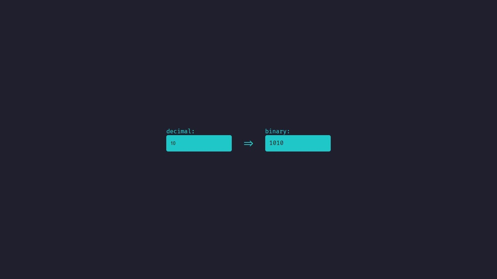

# Decimal-to-binary-converter
> Creating a decimal to binary converter

this is my solution to the <a href="https://github.com/florinpop17/app-ideas" >app-ideas</a> repository challenge 1!

* * * 

## if you want to run the project just open the index.html

* * * 

> ### now just put the desired value in decimals and it will be automatically converted to binary👍
> 